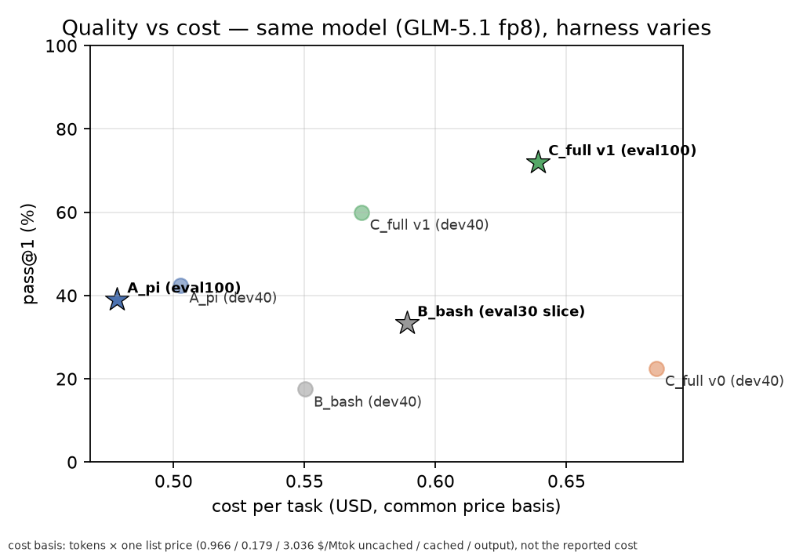
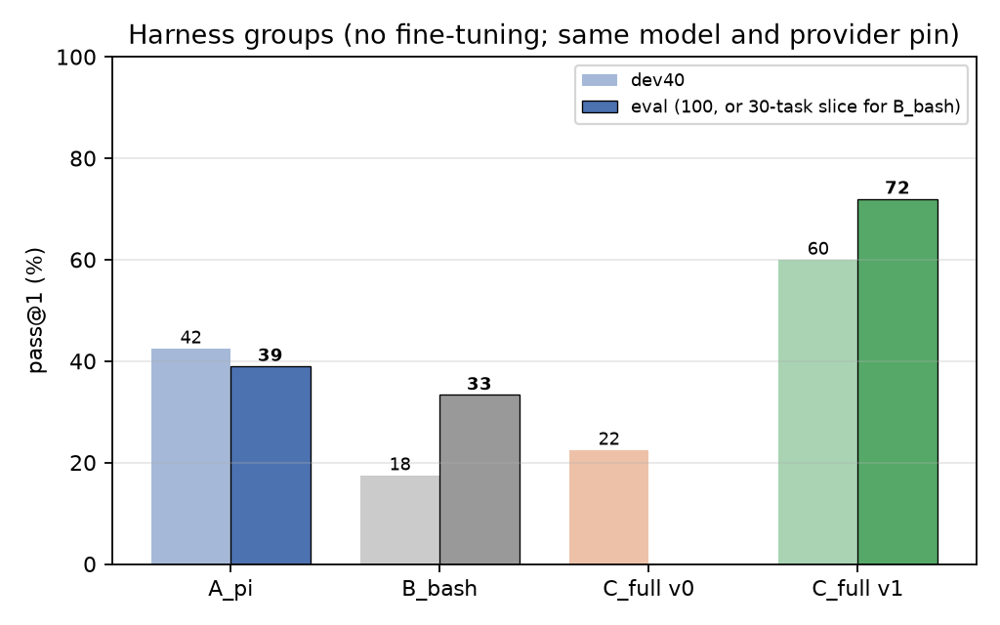

# A domain harness for ERP-Bench: 39% → 72% with the same model and no training

The eval100 numbers come from tag `harness-v1-eval100`, a build without delegation.
Everything here is reproducible from `analysis/*.json`, `analysis/results.csv` and the
scripts in `scripts/`.

## Result

ERP-Bench is 300 verifiable procurement and manufacturing tasks in a live Odoo 19
database; each grader scores constraints, hygiene and optimality on the final state. The
public leaderboard runs a generic coding-agent harness, `pi`. We built a domain harness
around the same model (GLM-5.1, fp8 via OpenRouter, same provider pin) and compared the
two on 100 held-out tasks frozen before any harness code existed.

| eval100 | pi | this harness |
|---|---|---|
| pass@1 | 39/100 | **72/100** |
| mean reward (0–100) | 54.7 | **88.9** |
| paired difference, pass@1 | | +33 pts, 95% CI [+22, +43], McNemar p = 1e-7 |
| won / lost, paired by task | | 37 / 4 |
| cost per task, one price basis | $0.48 | $0.64 |
| output tokens per task | 37k | 96k |
| cache hit rate | 75% | 86% |

By difficulty: easy 17/18 vs 12/18, medium 45/57 vs 22/57, hard 10/25 vs 5/25.

The gain is not the loop. `B_bash` (our loop with bash and a finish tool, no library)
scores 10/30 on a 30-task eval slice where pi scores 15/30 and this harness 23/30
(harness vs B_bash +43 pts, CI [+23, +63], p = 1e-3; pi vs B_bash +17, CI [−3, +37],
p = 0.18). On the 40-task dev set: pi 42.5%, B_bash 17.5%, harness v0 22.5%, v1 60%.

## What the harness is

The model works in a persistent Python kernel inside the task container, preloaded with:

- `erp` — a typed Odoo client. Write helpers refuse infeasible writes: a purchase dated
  before order date plus lead time, a receipt for goods that cannot have arrived, an MO
  starting before its components can exist, an origin naming an order the document
  cannot feed, a second PO on one supplier offer. Planning helpers (`feasible_vendors`,
  `cheapest_buy`, `earliest_build`, `workcenter_options`) do the date and cost arithmetic.
- `check` — 16 invariants from ERP practice (no drafts, non-negative stock, supplier
  validity, receipts before the demand they feed, components on hand when an MO starts,
  origin dates and quantities, work-centre capacity, one PO per offer, invoicing). Each
  names the failing record and the fix.
- `state` — database snapshots for rehearsing a plan on a clone before running it.
- `plan` and `brief` — a ledger with the task's objective, re-injected every 15 steps,
  and a front-loaded summary of demand, stock, offers and BOMs.
- `finish` — refuses up to three times while a hard check fails or nothing was written.
- `delegate` (added after the eval) — a read-only sub-agent with its own context.

Plus a four-step contract (write the rules down, plan, rehearse, execute once, finish)
and a playbook of Odoo 19 behaviour found empirically.

## How it was built

pi's dev-set failures were coded first: 17 of 23 were plans right in vendor, quantity and
price and wrong in dates. So the build order was timeline invariants, then rehearsal,
then the briefing; delegation last. The first complete build lost to pi on dev40 (22.5%
vs 42.5%). Reading its trajectories found the defects: a cache breakpoint that never
moved, a finish gate whose checks did not cover the dominant failure, prompts naming
modules the config did not ship, and a transport that dropped the finish call. Five dev
checkpoint passes then found the rest, each from a specific trajectory: the check trusted
the date the agent wrote; `receive(force=True)` fabricated stock; origins named orders
the goods could not reach; MOs had no due date or work centre; hand-picked vendor splits
lost on spend; a stated invoicing policy was applied only to delivered orders; the hour
limit cut long trajectories. Each became a rule, a helper or a refusal. Every rule is ERP
practice or a fact stated in the task instructions; nothing under `harness/` is keyed to
a task pattern, and eval tasks' graders were never read.
